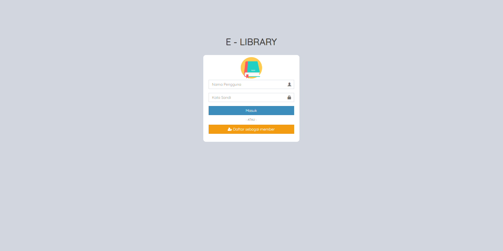
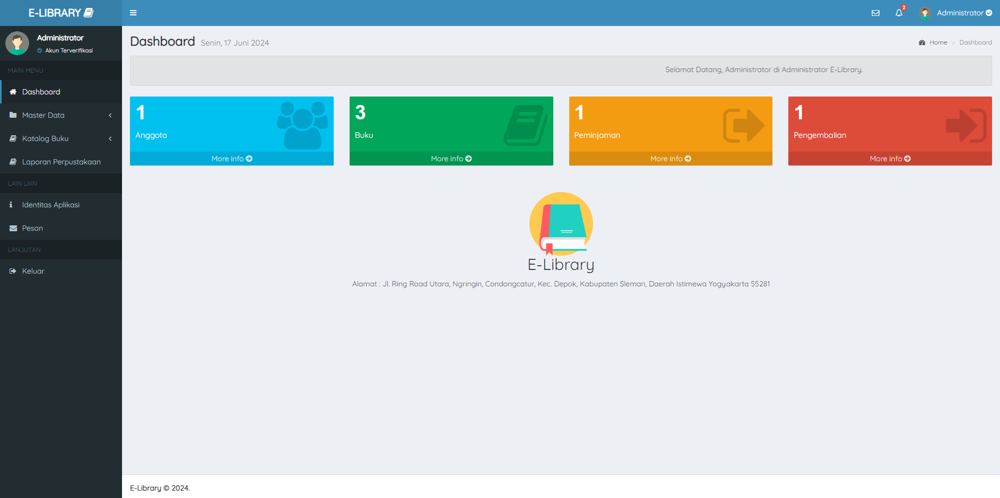

# 📕E-PERPUS
 Aplikasi perpustakaan sederhana ini dibuat menggunakan Template dari AdminLTE.io dan Menggunakan bahasa pemograman PHP MySQLi.    
 Aplikasi ini bebas untuk dikembangkan lagi atau untuk bahan pembelajaran kalian bagi yang mau membuat aplikasi perpustakaan, mungkin bisa mengambil contoh dari aplikasi ini

## 👷‍♂️Anggota Kelompok

1. Jessica Alva Nandhita
2. M Zainal Abidin
3. 
4. 
5. 
   
## 👦Akun Administrator
Username : admin
 
Password : admin

## 👀Preview

## ⚙Instalasi

1. Clone repositori dari GitHub ke htdocs dengan cmd : git clone https://github.com/aziziega/E-Library.git
2. Jalankan Xampp Apache dan Mysql
3. Buka Mysql admin dan buat database baru dengan nama db_perpustakaan lalu import dari folder database
4. Akses Web di browser dengan menjalankan Apache admin lalu arahkan ke folder yg dituju

## 🤲Terima Kasih
<ul>
    <li> AdminLTE </li>
    <li> PT. Pacifica Raya Technology </li>
    <li> Stackoverflow </li>
    <li> Google </li>
</ul>

